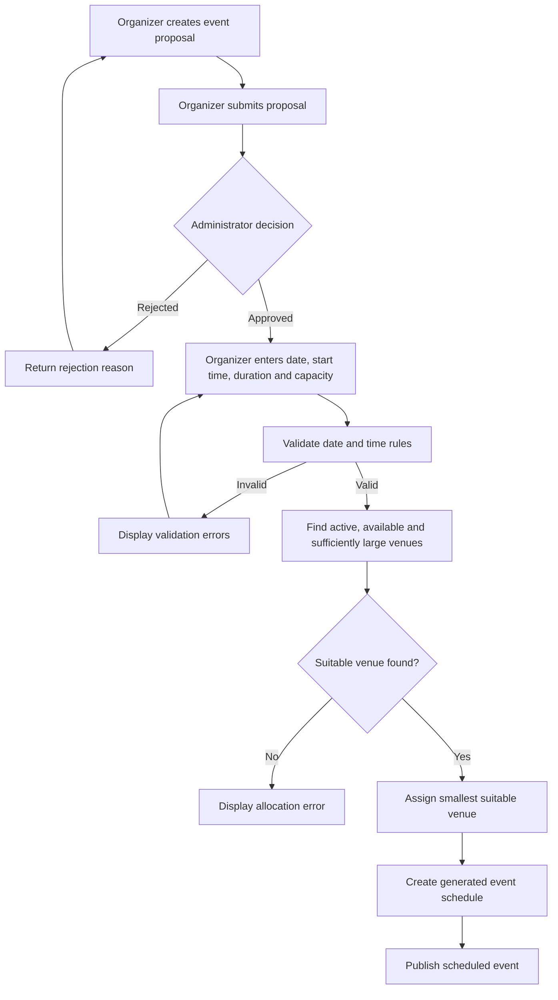
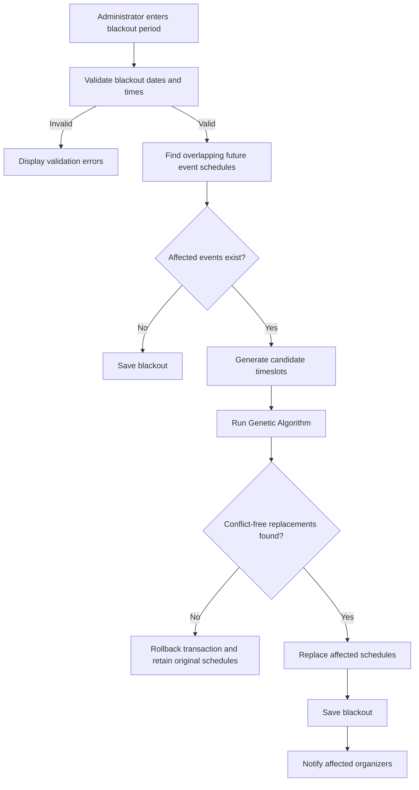
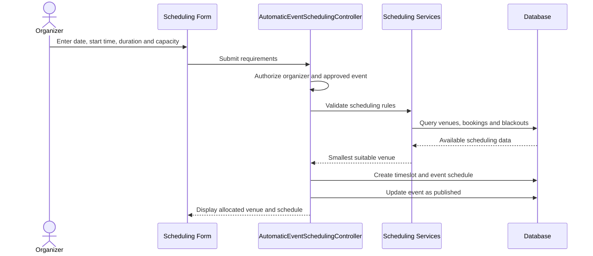
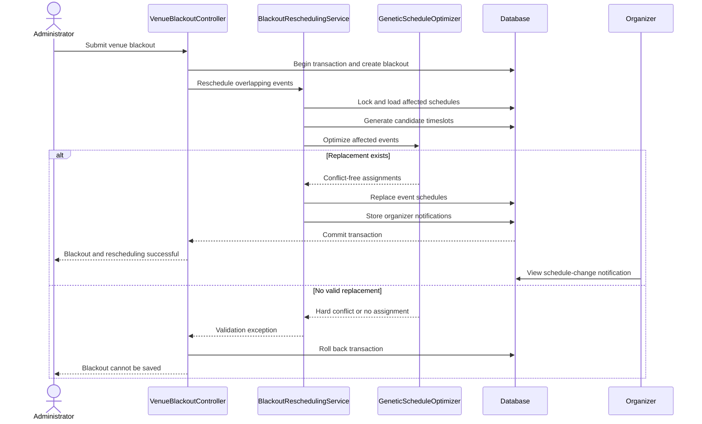

# FYP2 Report Updates: Automatic Scheduling and Blackout Rescheduling

This document contains ready-to-paste material for the editable FYP report. Replace outdated descriptions of manual scheduling, venue requests, and administrator application of schedules with the sections below. Update figure and table numbering after inserting the material into Microsoft Word.

## Quick Navigation

The remaining implementation discussion is organized into [Section 5.6: APIs and Integration](#56-apis-and-integration), [Section 5.7: Network Configuration](#57-network-configuration), [Section 5.8: Security Measures](#58-security-measures), [Section 5.9: Challenges Encountered and Solutions](#59-challenges-encountered-and-solutions), and [Section 5.10: Summary](#510-summary).

## How to Use the Chapter 5 Updates

This file contains replacement material only for report sections affected by the final scheduling workflow. Sections marked **No change required** are intentionally not reproduced later in this file; retain their existing content in the actual report.

| Actual report subsection | Required action | Location in this file |
|---|---|---|
| 5.5.1.2 User Authentication — Logic Used | No change required | Not reproduced |
| 5.5.2.2 Event Management and Proposal — Logic Used | No logic change required; the existing state-transition code remains accurate. Update the module's feature/integration wording instead | The generated **5.5.2.2 Logic Used** is optional reference material |
| 5.5.3.2 Venue and Timeslot Management — Logic Used | Keep the venue CRUD logic, but replace the outdated timeslot/blackout paragraph with transactional blackout rescheduling | See **5.5.3.2 Logic Used** |
| 5.5.4.2 Manual Scheduling and Constraint Validation — Logic Used | Replace the entire subsection and rename the module to **Automatic Event Allocation and Constraint Validation** | See **5.5.4.2 Logic Used** |
| 5.5.5.2 Genetic Algorithm Scheduling — Logic Used | Keep the existing GA operators and fitness logic; add the blackout-rescheduling use of the algorithm. The review-and-apply correction belongs mainly in **5.5.5.3 Integration** | See **5.5.5.2 Logic Used** |
| 5.5.6.2 Student Discovery, Registration and Personal Calendar — Logic Used | No change required | Not reproduced |
| 5.5.7.2 Notification and Reminder — Logic Used | Keep the existing student reminder logic and append organizer rescheduling notifications | See **5.5.7.2 Logic Used** |
| 5.5.8.2 Attendance — Logic Used | No change required | Not reproduced |
| 5.5.9.2 Analytics and Reporting — Logic Used | No change required | Not reproduced |

The sections below are arranged as complete replacement blocks. Where an action says **replace the entire subsection**, delete the corresponding content from the actual Word report before inserting the new material. Where it says **update**, retain accurate existing material and replace only the outdated scheduling paragraphs and examples.

## Abstract — Replacement Paragraph

Event management at Multimedia University (MMU) commonly involves fragmented communication and manual coordination of event approval, scheduling, venue allocation, registration, attendance, and reporting. These processes increase administrative workload and may result in scheduling conflicts or inefficient venue utilization. This project developed a web-based Event Management System (EMS) that centralizes these activities and incorporates automated, constraint-aware scheduling. An organizer first submits an event proposal for administrator approval. Once approved, the organizer provides the required date, start time, duration, and capacity, after which the system automatically allocates a suitable available venue. The system also manages venue blackout periods. If a newly created blackout overlaps a future scheduled event, a Genetic Algorithm searches for a conflict-free replacement schedule and the organizer is notified of the change. The scheduling process considers venue capacity, availability, existing bookings, operating hours, weekdays, blackout periods, event duration, future-date restrictions, and organizer preferences. The completed prototype also supports event discovery and registration, personal calendars, notifications and reminders, QR-based attendance, analytics, reporting, and evaluation of the Genetic Algorithm's scheduling performance. Automated testing produced 60 passing tests with 251 assertions, demonstrating that the principal workflows and scheduling constraints operate as intended.

## 1.4 Project Scope — Replacement Text

The scope of this project covers the design and implementation of a web-based Event Management System for students, event organizers, and administrators. Students can discover published events, register or cancel their participation, maintain a personal calendar, receive notifications and reminders, and record attendance. Event organizers can create event proposals, manage approved events, enter scheduling requirements, coordinate preparation tasks, publish announcements, manage attendance, and view event analytics. Administrators can review event proposals, manage users, societies and venues, define venue blackout periods, and review scheduling and reporting information.

Venue allocation is performed automatically rather than manually by an administrator. An organizer initially submits only the descriptive details of an event. After the administrator approves the proposal, the organizer enters the event date, start time, duration, and required capacity. The system then validates these requirements and automatically selects a suitable conflict-free venue. The system can also respond to changes in venue availability. When an administrator creates a blackout that overlaps a future scheduled event, the system invokes the Genetic Algorithm to search for a valid replacement venue and timeslot and notifies the affected organizer.

The Genetic Algorithm is evaluated using controlled performance tests that measure conflicts, venue utilization, fitness, and execution time. This evaluation provides evidence for the project's research objectives and is documented in the testing and evaluation chapter. It is not part of the normal event-management workflow.

## 1.5 Project Limitations — Replacement Text

The system is implemented as a university-scale prototype rather than a full enterprise scheduling platform. Scheduling considers venue capacity, active status, existing bookings, blackout periods, weekdays, operating hours, event duration, future-date requirements, and selected organizer preferences. More advanced constraints, including dependencies between multiple events, equipment requirements, travel time between venues, multi-day events, and recurring events, are outside the current scope.

Automatic blackout recovery searches for replacement schedules beginning from the original event date and within a limited fourteen-day extension. If no conflict-free replacement can be found, the blackout is not saved and the existing event schedule remains unchanged. This prevents the system from accepting a venue restriction that would leave an approved event without a valid schedule. External calendar synchronization, payment gateways, external push-notification providers, and production-scale deployment are also outside the current implementation.

## 3.3.1.4 Notification Function — Replacement Text

The notification function shall provide authenticated users with an in-application notification inbox. Registered students shall receive event announcements and scheduled reminders one week, one day, and one hour before their registered events. Event organizers shall receive a notification whenever one of their events is automatically rescheduled because of a venue blackout. A rescheduling notification shall identify the event, the previous schedule, the replacement schedule, and the reason for the blackout. Users shall be able to open individual notifications and mark all notifications as read.

## 3.3.1.5 Scheduling Function — Replacement Text

The scheduling function shall allocate venues automatically after an event proposal has been approved. The organizer shall provide the desired event date, start time, duration, and capacity. The system shall reject past dates, weekend dates, invalid time ranges, durations that do not use whole-hour boundaries, and events that exceed the supported operating hours. It shall consider only active venues with sufficient capacity that are not occupied or blacked out during the requested period. For initial allocation, the system shall assign the smallest suitable venue in order to reduce unused capacity.

If an administrator later creates a venue blackout that overlaps a future scheduled event, the system shall identify all affected events and use the Genetic Algorithm to determine conflict-free replacement assignments. The original date and start time shall be treated as preferences so that disruption is minimized where possible. Replacement schedules shall not overlap other events or blackouts and shall never be placed in the past.

## 3.3.1.7 Venue Management Function — Replacement Text

The venue management function shall allow administrators to create, update, activate, deactivate, and remove venue records. Each venue shall contain a name, location, capacity, description, and active status. Administrators shall also be able to define full-day or partial venue blackout periods for maintenance or other unavailability.

Venue selection shall not require an organizer to submit a request for a specific venue or an administrator to approve that venue manually. Instead, the system shall automatically evaluate all available venues against the event's capacity and time requirements. When a blackout affects an existing future schedule, the system shall attempt automatic rescheduling before committing the blackout.

## 3.3.2.3 Reliability — Addition

Schedule-changing operations shall use database transactions so that related changes are committed as one complete operation. In particular, creation of a venue blackout, deletion of an affected schedule, creation of a replacement schedule, and delivery of the corresponding database notification shall be treated as one transaction. If the system cannot produce a conflict-free replacement, the operation shall be rolled back to preserve the previous valid schedule.

## 3.3.3.3 Event Reminder and Update Notification — Replacement Text

Students need timely announcements and reminders for events for which they have registered. Event organizers also need immediate and understandable notification when venue unavailability causes an automatic schedule change. The notification should state both the previous and replacement date, time, and venue so that the organizer can communicate the change and adjust event preparations.

## 3.3.3.5 Standardized Event Planning Workflow — Replacement Text

Event organizers need a structured workflow that separates proposal approval from resource allocation. The organizer first submits the title, type, description, and other proposal information. The administrator then approves or rejects the proposal. Only after approval does the organizer enter the required date, start time, duration, and capacity. The system subsequently allocates a venue automatically and publishes the scheduled event. This reduces unnecessary scheduling work for proposals that have not yet received approval.

## 3.3.3.6 Venue Availability Checker — Replacement Text

Event organizers need venue availability to be evaluated automatically instead of manually comparing venue lists and calendars. The system should evaluate active status, capacity, existing bookings, blackout periods, event duration, date, and operating hours before assigning a venue. Administrators should retain control over venue information and blackout periods without being required to choose a venue for every event.

## 3.3.3.8 Visibility of Venue Usage and Conflicts — Replacement Text

Administrators need visibility of venue schedules, blackout periods, and utilization reports. The system should prevent invalid assignments before they are stored and should recover automatically when newly recorded venue unavailability conflicts with a future event. Organizers should be able to see the resulting event date, time, and venue from their event list and receive a notification if these details change.

## 4.3 Use Case Diagram — Required Changes

The revised use case diagram should remove the outdated use cases for requesting a venue, approving a venue request, manually creating or editing an event schedule, and applying an optimizer run to the operational schedule. These should be replaced with organizer entry of scheduling requirements after approval, system validation of those requirements, automatic allocation of a suitable venue, administrator creation of venue blackouts, detection of schedules affected by a blackout, GA-based rescheduling, delivery of schedule-change notifications to organizers, and administrator review of automatic schedules.

```plantuml
@startuml
title Updated Event Management System Use Case Diagram

left to right direction

skinparam backgroundColor white
skinparam shadowing false
skinparam packageStyle rectangle
skinparam ArrowColor #64748B
skinparam ActorBorderColor #0F172A
skinparam ActorFontColor #0F172A
skinparam UsecaseBorderColor #475569
skinparam UsecaseBackgroundColor white
skinparam UsecaseFontColor #0F172A
skinparam RectangleBorderColor #334155
skinparam RectangleFontColor #0F172A

actor Student
actor Organizer
actor Administrator

rectangle "Event Management System" {
    package "Account and Shared Functions" {
        usecase "Register student account" as UC_Register
        usecase "Log in / log out" as UC_Authenticate
        usecase "Reset password" as UC_ResetPassword
        usecase "View notifications" as UC_Notifications
        usecase "Submit system feedback" as UC_Feedback
    }

    package "Student Functions" {
        usecase "Discover and search\npublished events" as UC_Discover
        usecase "Register for or cancel\nevent participation" as UC_EventRegistration
        usecase "Validate capacity and\ncalendar conflicts" as UC_RegistrationChecks
        usecase "View personal calendar" as UC_Calendar
        usecase "Manage personal\ncommitments" as UC_Commitments
        usecase "Check in using QR code" as UC_QRCheckIn
        usecase "View attendance history" as UC_AttendanceHistory
    }

    package "Organizer Functions" {
        usecase "Create and edit\nevent proposal" as UC_ManageProposal
        usecase "Submit proposal\nfor approval" as UC_SubmitProposal
        usecase "Enter date, time,\nduration and capacity" as UC_Requirements
        usecase "Validate scheduling\nconstraints" as UC_ValidateSchedule
        usecase "Automatically allocate\nsuitable venue" as UC_AllocateVenue
        usecase "Publish scheduled event" as UC_PublishEvent
        usecase "View allocated\nevent schedule" as UC_ViewSchedule
        usecase "Manage event tasks" as UC_Tasks
        usecase "Publish participant\nannouncements" as UC_Announcements
        usecase "Manage QR attendance sessions\nand manual check-in" as UC_ManageAttendance
        usecase "View analytics and\noperational reports" as UC_OrganizerReports
    }

    package "Administrator Functions" {
        usecase "Approve or reject\nevent proposal" as UC_ReviewProposal
        usecase "Manage users and roles" as UC_Users
        usecase "Manage societies" as UC_Societies
        usecase "Manage venues" as UC_Venues
        usecase "Manage venue\nblackout periods" as UC_Blackouts
        usecase "Detect schedules affected\nby a new blackout" as UC_DetectConflicts
        usecase "Reschedule affected events\nusing Genetic Algorithm" as UC_GAReschedule
        usecase "Notify organizer of\nschedule changes" as UC_NotifyOrganizer
        usecase "Review automatic\nallocations" as UC_ReviewAllocations
        usecase "Run GA performance tests" as UC_GATests
        usecase "Review evaluation results" as UC_EvaluationResults
        usecase "View analytics and\noperational reports" as UC_AdminReports
    }
}

Student -- UC_Register
Student -- UC_Authenticate
Student -- UC_ResetPassword
Student -- UC_Notifications
Student -- UC_Feedback
Student -- UC_Discover
Student -- UC_EventRegistration
Student -- UC_Calendar
Student -- UC_Commitments
Student -- UC_QRCheckIn
Student -- UC_AttendanceHistory

Organizer -- UC_Authenticate
Organizer -- UC_ResetPassword
Organizer -- UC_Notifications
Organizer -- UC_Feedback
Organizer -- UC_ManageProposal
Organizer -- UC_SubmitProposal
Organizer -- UC_Requirements
Organizer -- UC_ViewSchedule
Organizer -- UC_Tasks
Organizer -- UC_Announcements
Organizer -- UC_ManageAttendance
Organizer -- UC_OrganizerReports

Administrator -- UC_Authenticate
Administrator -- UC_ResetPassword
Administrator -- UC_Feedback
Administrator -- UC_ReviewProposal
Administrator -- UC_Users
Administrator -- UC_Societies
Administrator -- UC_Venues
Administrator -- UC_Blackouts
Administrator -- UC_ReviewAllocations
Administrator -- UC_GATests
Administrator -- UC_EvaluationResults
Administrator -- UC_AdminReports

UC_EventRegistration ..> UC_RegistrationChecks : <<include>>
UC_Requirements ..> UC_ValidateSchedule : <<include>>
UC_Requirements ..> UC_AllocateVenue : <<include>>
UC_AllocateVenue ..> UC_PublishEvent : <<include>>
UC_Blackouts ..> UC_DetectConflicts : <<include>>
UC_GAReschedule ..> UC_DetectConflicts : <<extend>>
UC_GAReschedule ..> UC_NotifyOrganizer : <<include>>

@enduml
```



**Figure 4.x: Updated use case diagram for the Event Management System**

## 4.4 Activity Diagrams

### Event Approval and Automatic Allocation



Suggested caption: **Figure 4.x: Event Approval and Automatic Venue Allocation Activity Diagram**

### Blackout Conflict and Automatic Rescheduling



Suggested caption: **Figure 4.x: Venue Blackout and Automatic Event Rescheduling Activity Diagram**

## 4.5 Class Diagram — Required Updates

The diagram should show that each `Event` belongs to an organizer represented by `User` and receives an `EventSchedule` after successful allocation. Each `EventSchedule` belongs to one `Event`, `Venue`, and `Timeslot`, while each `Venue` may have many `VenueBlackout` records and each `User` may have many database `Notification` records. Evaluation records may be presented separately from the core operational classes because they support performance testing rather than everyday event management.

The diagram should not show `VenueRequest` as part of the active operational workflow. If the legacy database table remains documented, label it as unused or retained for historical compatibility.

## 4.6 Sequence Diagrams

### Replace “Venue Request and Admin Approval” with “Automatic Venue Allocation”



Suggested caption: **Figure 4.x: Automatic Venue Allocation Sequence Diagram**

### New Blackout Rescheduling Sequence



Suggested caption: **Figure 4.x: Blackout-Based Genetic Algorithm Rescheduling Sequence Diagram**

## 4.7 Interface Design — Screenshots to Insert

The interface design section should include current screenshots of the administrator proposal approval screen, the organizer form for entering date, start time, duration, and capacity, and the organizer event list showing the resulting date, time, and allocated venue. It should also show the administrator venue blackout form, a successful blackout message reporting the number of rescheduled events, the organizer notification inbox containing the previous and replacement schedules, and the read-only administrator schedule list. GA performance results should be presented in the testing and evaluation chapter rather than as part of the operational interface discussion. Screenshots of venue-request submission, venue-request approval, manual schedule creation, and application of an operational optimizer run should be removed because those interfaces no longer represent the final workflow.

## 5.4.1 Database Schema Design — Replacement Scheduling Paragraph

The scheduling domain is represented primarily by the `events`, `venues`, `timeslots`, `event_schedules`, and `venue_blackouts` tables. An event may exist without a schedule while it is being drafted, submitted, or reviewed. After approval and successful automatic allocation, `event_schedules` associates the event with one venue and one timeslot. Timeslot records are generated from organizer requirements and candidate scheduling windows rather than manually maintained as an administrator-facing resource. Venue blackout records contain a venue, start datetime, end datetime, and reason.

The `notifications` table stores user-specific database notifications. In addition to announcements and reminders for students, it stores organizer notifications created after automatic blackout rescheduling. The notification payload contains the event identifier and title, the previous schedule, the replacement schedule, the blackout reason, and a link to the organizer's event list.

The `optimization_runs`, `optimization_assignments`, and `optimization_experiments` tables store evidence used to evaluate GA performance. They are evaluation-support tables rather than core operational entities and may be documented separately from the main database workflow. Initial venue allocation is performed immediately from the organizer's approved requirements, while the Genetic Algorithm is invoked operationally when blackout conflicts require one or more future events to be rescheduled.

## 5.5.2 Event Management and Proposal Module — Replacement Feature and Integration Text

### 5.5.2.1 Feature / Functionality

Organizers create event proposals containing descriptive information such as title, event type, and description. Scheduling requirements are deliberately excluded at this stage because the event has not yet been approved. The organizer submits the proposal, after which an administrator approves it or rejects it with a reason. Only an approved event exposes the scheduling-requirements form to its organizer.

### 5.5.2.2 Logic Used

The proposal lifecycle is controlled through the `EventStatus` enum. Submission is permitted only for an event in an editable state and only when the authenticated user is authorized to manage that event. Submission records the submission time and clears any previous review information:

```php
public function submit(Request $request, Event $event)
{
    abort_unless($request->user()->canManageEvent($event), 403);
    abort_unless($event->status->isEditable(), 422);

    $event->update([
        'status' => EventStatus::Submitted,
        'submitted_at' => now(),
        'reviewed_at' => null,
        'reviewed_by' => null,
        'rejection_reason' => null,
    ]);
}
```

Administrators may approve only submitted events. Approval records the reviewer and review time but does not allocate a venue. Instead, it enables the organizer to access the automatic scheduling form:

```php
public function approve(Request $request, Event $event)
{
    abort_unless($event->status === EventStatus::Submitted, 422);

    $event->update([
        'status' => EventStatus::Approved,
        'reviewed_at' => now(),
        'reviewed_by' => $request->user()->id,
        'rejection_reason' => null,
    ]);
}
```

The suggested figure captions are **Figure 5.x: Event proposal submission logic** and **Figure 5.x: Administrator proposal approval logic**.

### 5.5.2.3 Integration with Other Components

Approval makes the event eligible for the automatic allocation module. The organizer then supplies the date, start time, duration, and capacity. A rejected event returns to an editable state, while a successfully allocated event receives an `EventSchedule` and becomes published. Administrators do not manually assign venues to approved events.

## 5.5.3 Venue and Timeslot Management Module — Replacement Text

### 5.5.3.1 Feature / Functionality

Administrators maintain venue master data, including each venue's name, location, capacity, description, and active status. They can also create full-day or partial blackout periods when a venue is unavailable. Timeslots are generated internally from event durations and valid scheduling windows; therefore, administrators are not required to create timeslot records manually.

When a blackout is submitted, `VenueBlackoutController` validates the interval and creates the blackout within a database transaction. It then delegates to `BlackoutReschedulingService`, which locates future schedules whose venue and time interval overlap the blackout. A strict interval comparison is used, so an event conflicts when its start is earlier than the blackout end and its end is later than the blackout start.

### 5.5.3.2 Logic Used

The controller supports a blackout for one venue or all venues. After validating and normalizing the date and time range, it creates the blackout records and immediately requests rescheduling within the same database transaction:

```php
$venues = $request->boolean('all_venues')
    ? Venue::all()
    : collect([$venue]);

$rescheduledCount = DB::transaction(function () use (
    $venues,
    $startsAt,
    $endsAt,
    $validated
): int {
    foreach ($venues as $targetVenue) {
        $targetVenue->blackouts()->create([
            'starts_at' => $startsAt,
            'ends_at' => $endsAt,
            'reason' => $validated['reason'],
        ]);
    }

    return $this->rescheduling->reschedule(
        $venues,
        $startsAt,
        $endsAt,
        $validated['reason'],
    );
});
```

Affected schedules are first narrowed by venue and date, then checked using actual datetime boundaries. Only future events with a genuine interval overlap are selected:

```php
return $eventStarts->isFuture()
    && $eventStarts->lt($endsAt)
    && $eventEnds->gt($startsAt);
```

If rescheduling throws a validation exception, Laravel rolls back the transaction. Therefore, the blackout, replacement schedules, and notifications are either saved together or not saved at all.

Suggested caption: **Figure 5.x: Transactional blackout creation and conflict detection**

### 5.5.3.3 Integration with Other Components

Venue data is consumed by automatic allocation and GA rescheduling. Blackout records are checked when candidate venues are selected, while affected event schedules are passed to `BlackoutReschedulingService`. Successfully rescheduled events subsequently generate notifications for their organizers.

## 5.5.4 Automatic Event Allocation and Constraint Validation Module — Replace Entire Manual Scheduling Subsection

### 5.5.4.1 Feature / Functionality

After administrator approval, the organizer enters the event date, start time, duration, and expected capacity. `AutomaticEventSchedulingController` verifies that the event belongs to the organizer and is in the approved state. The scheduling policy rejects past dates, weekends, invalid hour boundaries, and end times outside the permitted operating period.

The allocation query considers only active venues whose capacity is at least the event capacity. It excludes venues that have an overlapping blackout or an existing event schedule during the requested period. Remaining venues are ordered by capacity so that the smallest suitable venue is selected, reducing unused seats while satisfying the event requirement. The timeslot, event schedule, and event status update are saved transactionally.

### 5.5.4.2 Logic Used

The controller accepts only the requirements needed for allocation. The date must not be earlier than the current date, duration must be between one and fifteen hours in whole-hour increments, and capacity must be positive:

```php
$validated = $request->validate([
    'slot_date' => ['required', 'date', 'after_or_equal:today'],
    'start_time' => ['required', 'date_format:H:i'],
    'duration_minutes' => [
        'required', 'integer', 'min:60', 'max:900', 'multiple_of:60',
    ],
    'capacity' => ['required', 'integer', 'min:1'],
]);
```

`SchedulingTimePolicy` converts the selected values into complete datetime boundaries. It rejects a start that is not in the future, weekend dates, non-hour boundaries, and times outside the supported operating period. An event that ends after the normal 6:00 PM closing time is marked as using extended hours and may finish no later than 11:00 PM.

The suitable-venue query applies capacity and availability constraints directly in the database:

```php
$venue = Venue::query()
    ->where('is_active', true)
    ->where('capacity', '>=', $validated['capacity'])
    ->whereDoesntHave('schedules', function ($query) use ($validated, $endsAt): void {
        $query->whereHas('timeslot', function ($query) use ($validated, $endsAt): void {
            $query->whereDate('slot_date', $validated['slot_date'])
                ->where('start_time', '<', $endsAt->format('H:i:s'))
                ->where('end_time', '>', $validated['start_time'].':00');
        });
    })
    ->whereDoesntHave('blackouts', function ($query) use ($startsAt, $endsAt): void {
        $query->where('starts_at', '<', $endsAt)
            ->where('ends_at', '>', $startsAt);
    })
    ->orderBy('capacity')
    ->orderBy('name')
    ->lockForUpdate()
    ->first();
```

Ordering first by capacity selects the closest capacity match. Row locking and a database transaction protect the allocation from concurrent changes. After a venue is found, the system creates or reuses the exact timeslot, creates a generated schedule, stores the requirements on the event, and changes its status to `Published`:

```php
$timeslot = Timeslot::firstOrCreate([
    'slot_date' => $validated['slot_date'],
    'start_time' => $validated['start_time'].':00',
    'end_time' => $endsAt->format('H:i:s'),
]);

EventSchedule::create([
    'event_id' => $event->id,
    'venue_id' => $venue->id,
    'timeslot_id' => $timeslot->id,
    'status' => 'generated',
]);

$event->update([
    'capacity' => $validated['capacity'],
    'duration_minutes' => $validated['duration_minutes'],
    'preferred_venue_id' => $venue->id,
    'preferred_date' => $validated['slot_date'],
    'preferred_start_time' => $validated['start_time'],
    'status' => EventStatus::Published,
]);
```

The suggested figure captions are **Figure 5.x: Automatic venue filtering and selection** and **Figure 5.x: Transactional creation of the generated event schedule**.

### 5.5.4.3 Integration with Other Components

The resulting schedule is displayed to organizers and administrators in the event list and is used by event discovery, registration, calendars, reminders, attendance, analytics, and reports. Since no operational manual scheduling route is exposed, administrators retain oversight without becoming responsible for assigning every venue.

Suggested screenshot: organizer scheduling requirements form followed by the event list displaying the generated venue, date, and time.

## 5.5.5 Genetic Algorithm Scheduling Module — Replacement Text

### 5.5.5.1 Feature / Functionality

The Genetic Algorithm is used to search a large set of venue-timeslot combinations while respecting hard constraints and minimizing soft penalties. In the operational workflow, it is invoked when an administrator creates a blackout that overlaps one or more future scheduled events. For research evaluation, controlled performance tests use fixed parameter configurations and random seeds so that fitness, conflicts, utilization, and execution time can be compared consistently. These tests provide evidence for the project objectives but are not an event-management function used during normal scheduling.

A gene represents one event assignment containing an event identifier, venue identifier, timeslot identifier, date, start time, end time, venue capacity, and calculated soft penalty. A chromosome maps every affected event to a gene. The initial population is generated randomly from precomputed feasible options. Tournament selection chooses parents, uniform crossover combines their assignments, mutation replaces selected genes with other feasible options, and elitism carries the best candidates into the next generation.

Candidate options are removed before evolution when they use an inactive or undersized venue, a weekend or past time, an invalid operating hour, an inadequate duration, an overlapping blackout, or a venue already occupied by an unaffected event. During fitness evaluation, the algorithm also identifies collisions between affected events assigned to the same venue during overlapping times.

The fitness calculation is:

```text
fitness = max(0, 10000 - (hard conflicts × 1000) - soft penalty)
```

The soft penalty represents unused venue capacity, unused timeslot duration, and deviation from preferred venue, date, or start time. During blackout recovery, the original event date and start time are temporarily treated as preferences, while the unavailable venue preference is cleared. This encourages the algorithm to preserve the original time where possible while permitting a different venue.

`BlackoutReschedulingService` searches from the earliest affected event date through fourteen days after the latest affected event date. The service uses a deterministic seed derived from the affected event identifiers and blackout start time. If every event receives a conflict-free assignment, the old schedules are replaced and organizer notifications are created. If the best chromosome contains a hard conflict or an unassigned event, a validation exception rolls back the entire blackout transaction.

### 5.5.5.2 Logic Used

For blackout recovery, the service first retains a displayable copy of each original schedule. It then uses the original date and start time as temporary soft preferences while clearing the unavailable venue preference:

```php
$schedules->each(function (EventSchedule $schedule): void {
    $event = $schedule->event;
    $event->preferred_date = $schedule->timeslot->slot_date;
    $event->preferred_start_time = $schedule->timeslot->start_time;
    $event->preferred_venue_id = null;
});
```

The conflicting schedules are removed inside the transaction so that the optimizer does not treat them as permanent bookings. Candidate timeslots are generated for the rescheduling window, active venues and their blackout records are loaded, and the affected events are passed to the optimizer:

```php
$schedules->each->delete();

$timeslots = $this->automaticTimeslots->generate(
    $events,
    $windowStart,
    $windowEnd,
);

$venues = Venue::with('blackouts')
    ->where('is_active', true)
    ->orderBy('id')
    ->lockForUpdate()
    ->get();

$result = $this->optimizer->optimize($events, $venues, $timeslots, [
    'population_size' => min(150, max(60, $events->count() * 30)),
    'generations' => 250,
    'mutation_rate' => 0.10,
    'seed' => $seed,
]);
```

`GeneticScheduleOptimizer::buildOptions()` removes infeasible genes before evolution. The remaining chromosomes are evaluated using hard-conflict and soft-penalty values. Tournament selection, uniform crossover, mutation, and elitism are repeated for the configured number of generations or until a sufficiently good result is found.

Before replacement schedules are stored, the service rejects any result containing hard conflicts or missing assignments:

```php
if ($result['hard_conflicts'] > 0) {
    throw ValidationException::withMessages([
        'blackout_date' => 'No conflict-free replacement schedule is available.',
    ]);
}

foreach ($events as $event) {
    $assignment = $result['chromosome'][$event->id] ?? null;

    if (! $assignment) {
        throw ValidationException::withMessages([
            'blackout_date' => 'An affected event could not be rescheduled.',
        ]);
    }

    EventSchedule::create([
        'event_id' => $event->id,
        'venue_id' => $assignment['venue_id'],
        'timeslot_id' => $assignment['timeslot_id'],
        'status' => 'generated',
    ]);
}
```

Because the controller invoked this service inside the blackout transaction, an infeasible result restores the deleted original schedules and prevents the new blackout from being committed.

### 5.5.5.3 Integration with Other Components

The module reads events, venues, timeslots, existing schedules, and venue blackouts. It writes replacement `event_schedules` records through the rescheduling service and triggers `EventRescheduledNotification` for each affected organizer. GA performance tests are discussed under testing and evaluation and must not be presented as a step in the live scheduling workflow.

Suitable figures for this subsection are the feasible-option generation performed by `GeneticScheduleOptimizer::buildOptions`, the fitness calculation performed by `GeneticScheduleOptimizer::evaluate`, and the transactional rescheduling performed by `BlackoutReschedulingService::reschedule`.

## 5.5.7 Notification and Reminder Module — Replacement Text

### 5.5.7.1 Feature / Functionality

The notification module serves both students and event organizers. Registered students receive event announcements and idempotent reminders at one week, one day, and one hour before an event. Organizers receive an automatic notification when a venue blackout causes one of their events to be rescheduled. Notifications are stored through Laravel's database notification channel and can be opened individually or marked as read in bulk.

`EventRescheduledNotification` stores an `event_rescheduled` notification type, title, explanatory message, event identifier and title, previous schedule, replacement schedule, and destination URL. The message includes the blackout reason so that the organizer understands why the change occurred.

### 5.5.7.2 Logic Used

After a replacement schedule is created and its venue and timeslot relationships are loaded, the rescheduling service sends a database notification to the event organizer:

```php
$event->organizer?->notify(new EventRescheduledNotification(
    $event,
    $originals[$event->id],
    $this->scheduleData($replacement),
    $reason,
));
```

The notification uses Laravel's database channel and constructs a payload containing both schedules:

```php
public function via(object $notifiable): array
{
    return ['database'];
}

public function toArray(object $notifiable): array
{
    return [
        'kind' => 'event_rescheduled',
        'title' => 'Event automatically rescheduled',
        'message' => $this->event->title.' was moved from '
            .$this->description($this->oldSchedule).' to '
            .$this->description($this->newSchedule)
            .' because of a venue blackout: '.$this->blackoutReason.'.',
        'event_id' => $this->event->id,
        'event_title' => $this->event->title,
        'old_schedule' => $this->oldSchedule,
        'new_schedule' => $this->newSchedule,
        'url' => route('events.index'),
    ];
}
```

Suggested caption: **Figure 5.x: Organizer notification after automatic rescheduling**

### 5.5.7.3 Integration with Other Components

Rescheduling notifications are created by `BlackoutReschedulingService` after the replacement `EventSchedule` has been stored. Because this occurs inside the blackout transaction, the notification is not retained if schedule replacement fails and the transaction is rolled back. The organizer navigation displays the notification inbox and unread count.

## 5.6 APIs and Integration

The system is implemented as a server-rendered Laravel web application. Browser requests are received through Laravel routes, processed by controllers and services, and returned as Blade-rendered HTML pages, redirects, CSV downloads, or locally generated QR-code images. The current prototype does not expose a public REST API and does not depend on an external scheduling API. This reduces integration complexity and ensures that scheduling rules remain within the application domain.

Integration between modules is achieved through Laravel services, Eloquent relationships, database transactions, notifications, scheduled commands, and named routes. For example, `VenueBlackoutController` delegates schedule recovery to `BlackoutReschedulingService`, which uses `AutomaticTimeslotService` and `GeneticScheduleOptimizer`. Successful recovery then invokes `EventRescheduledNotification`. This service-based separation allows the scheduling algorithm to be reused without placing its implementation directly inside a controller.

### 5.6.1 Description of Internal APIs or Third-Party APIs Used

The application uses internal HTTP endpoints defined in `routes/web.php`. These endpoints follow Laravel's controller-based routing model and are protected by guest, authenticated-user, and role middleware. Route model binding converts identifiers in URLs into Eloquent model instances, while controllers validate incoming form data and invoke the appropriate domain services.

No external web API is required for event scheduling, notifications, reporting, or attendance. Laravel Framework supplies routing, controllers, validation, authentication, sessions, authorization middleware, database access, notifications, queues, scheduling, password reset, and error handling. The Endroid QR Code package generates attendance QR codes as SVG data URIs within the application, meaning that attendance information is not sent to an external QR-code service. Vite and Tailwind CSS compile and bundle frontend assets, while Flowbite supports the interface components and styling. MySQL stores the application, session, cache, queue, notification, and domain records in the development configuration. Laravel's task scheduler executes the `events:send-reminders` command every minute and prevents overlapping executions.

The QR integration is encapsulated by `QrCodeService`:

```php
public function dataUri(string $data): string
{
    $qrCode = new QrCode(
        data: $data,
        errorCorrectionLevel: ErrorCorrectionLevel::Medium,
        size: 360,
        margin: 16,
    );

    return (new SvgWriter)->write($qrCode)->getDataUri();
}
```

Suggested caption: **Figure 5.x: Local QR-code generation service**

### 5.6.2 API Endpoints Implemented

Although the system does not provide a public REST API, its internal web endpoints form the interface between the browser and application controllers. The principal endpoints are summarized below.

| Method | Endpoint | Purpose | Access |
|---|---|---|---|
| GET, POST | `/register` | Display and process account registration | Guest |
| GET, POST | `/login` | Display and process authentication | Guest |
| POST | `/logout` | End the authenticated session | Authenticated user |
| GET | `/dashboard` | Display the dashboard for the current role | Authenticated user |
| GET, POST | `/events` | List events or create an event proposal | Organizer; administrators may view |
| POST | `/events/{event}/submit` | Submit an event proposal for review | Organizer |
| GET, POST | `/events/{event}/allocate` | Enter requirements and allocate a venue automatically | Organizer |
| GET | `/proposals` | Review submitted event proposals | Administrator |
| PATCH | `/proposals/{event}/approve` | Approve an event proposal | Administrator |
| PATCH | `/proposals/{event}/reject` | Reject an event proposal with a reason | Administrator |
| Resource routes | `/venues` | Maintain venue records | Administrator |
| GET, POST | `/venues/{venue}/blackouts` | View or create venue blackouts | Administrator |
| DELETE | `/venues/{venue}/blackouts/{blackout}` | Remove a venue blackout | Administrator |
| GET | `/schedules` | Review automatically generated allocations | Administrator |
| GET | `/discover` | Search published events | Student |
| POST, DELETE | `/events/{event}/register` | Register for or cancel an event | Student |
| GET | `/calendar` | View registered events and personal commitments | Student |
| GET, POST | `/check-in/{token}` | Display and process attendance check-in | Student |
| GET | `/notifications` | View the current user's notification inbox | Authenticated user |
| PATCH | `/notifications/read-all` | Mark all current-user notifications as read | Authenticated user |
| GET | `/reports` | View date-filtered operational reports | Organizer or administrator |
| GET | `/reports/events.csv` | Export event-performance records | Organizer or administrator |
| GET | `/reports/venues.csv` | Export venue-utilization records | Organizer or administrator |
| GET, POST | `/experiments` | View or run GA performance evaluations | Administrator |

All state-changing browser forms use the appropriate POST, PATCH, PUT, or DELETE method and include Laravel's Cross-Site Request Forgery token.

### 5.6.3 JSON / XML Payload Structure

The current application does not exchange JSON or XML payloads with an external client. Standard browser forms submit URL-encoded request data, while controllers return Blade-rendered HTML or redirects. CSV is used for downloadable event, venue, and experiment evidence.

JSON is used internally for data whose structure may contain multiple evaluation values. For example, `optimization_runs.metrics`, `optimization_assignments.details`, `optimization_experiments.dataset`, and `optimization_experiments.results` are stored as JSON columns and cast to PHP arrays by Eloquent. Laravel database notifications similarly serialize their data array into the `notifications.data` field.

An event-rescheduling notification uses the following logical payload structure:

```json
{
  "kind": "event_rescheduled",
  "title": "Event automatically rescheduled",
  "message": "The event was moved because of a venue blackout.",
  "event_id": 15,
  "event_title": "Technology Career Fair",
  "old_schedule": {
    "date": "12 Oct 2026",
    "start": "10:00 AM",
    "end": "12:00 PM",
    "venue": "Main Hall"
  },
  "new_schedule": {
    "date": "12 Oct 2026",
    "start": "10:00 AM",
    "end": "12:00 PM",
    "venue": "Lecture Hall 2"
  },
  "url": "/events"
}
```

This is an internal persisted payload rather than a public API contract. XML is not used by the implemented system.

### 5.6.4 Authentication Mechanisms

The system uses Laravel's session-based web authentication. It does not use JWT or OAuth because the current application is a first-party browser application rather than a stateless API or third-party integration platform.

During login, the email and password are validated and passed to Laravel's authentication service. Successful login regenerates the session identifier to reduce session-fixation risk. Logout invalidates the session and regenerates the Cross-Site Request Forgery token:

```php
public function store(LoginRequest $request): RedirectResponse
{
    $request->authenticate();
    $request->session()->regenerate();

    return redirect()->intended(route('dashboard', absolute: false));
}

public function destroy(Request $request): RedirectResponse
{
    auth()->guard('web')->logout();
    $request->session()->invalidate();
    $request->session()->regenerateToken();

    return redirect()->route('home');
}
```

Login attempts are rate-limited to five attempts for each normalized email-address and IP-address combination. Passwords are processed through Laravel's `hashed` model cast and are never stored as plaintext. Public registration always assigns the `Student` role; only an administrator can change a user's role through the protected user-management module.

## 5.7 Network Configuration

The application was developed and evaluated in a local client-server environment. The browser communicates with the Laravel application over HTTP, while Laravel connects to MySQL through the configured database host and port. Vite provides frontend assets during development. The application does not require inbound connections to a separate optimization server because the Genetic Algorithm executes within the Laravel process.

Configuration values are kept in the `.env` file rather than embedded in source code. These include the application URL and key, database connection, mail transport, session driver, queue driver, cache driver, and logging configuration. The distributable `.env.example` contains placeholders and defaults without containing production secrets.

### 5.7.1 Hosting Setup

Development and testing were performed on localhost. The Laravel development server serves the application, MySQL provides persistent storage, and Vite serves or compiles frontend assets. The Composer development script starts the application server, queue listener, log viewer, Vite development server, and Laravel scheduler together:

```text
composer run dev
```

The system also provides a health-check endpoint at `/up`, which can be used by a deployment platform or reverse proxy to determine whether the Laravel application is responding.

The current project has not been deployed to a public production host. Therefore, production hosting availability, domain configuration, Transport Layer Security certificate renewal, backup automation, and production traffic measurements are outside the completed deployment scope.

### 5.7.2 Port Configuration

The development environment uses the standard ports associated with its components unless explicitly overridden:

| Component | Default development port | Purpose |
|---|---:|---|
| Laravel development server | 8000 | Application HTTP requests |
| Vite development server | 5173 | Frontend assets and hot module replacement |
| MySQL | 3306 | Relational database connection |

Only the Laravel HTTP endpoint needs to be accessed by the browser during normal use. MySQL should remain restricted to the application environment rather than being publicly exposed. In a production deployment, a web server or reverse proxy would normally listen on ports 80 and 443 and forward PHP requests to the application runtime.

### 5.7.3 Deployment to Server or Live Environment

No public live-server deployment was completed for the current prototype. A production deployment would begin by provisioning a supported PHP runtime, web server, MySQL database, and Node.js build environment. PHP dependencies would be installed using `composer install --no-dev --optimize-autoloader`, after which production environment variables would be configured with a unique application key and protected database credentials. The environment would use `APP_ENV=production` and `APP_DEBUG=false`. Frontend dependencies would then be installed and compiled using `npm run build`, while database migrations would be applied through `php artisan migrate --force`.

The production web server would use Laravel's `public` directory as its document root and provide HTTPS with secure session cookies. A persistent queue worker would be required where queued processing is enabled, and the server scheduler would execute `php artisan schedule:run` every minute. The application runtime would receive write access only to the required `storage` and `bootstrap/cache` directories. Database backups, application-file backups, monitoring, and log rotation would also be configured. This description presents the required production path without implying that the prototype has already been publicly deployed.

## 5.8 Security Measures

Security controls are applied at the request, authentication, authorization, persistence, and attendance layers. Laravel's built-in protections are combined with application-specific ownership checks, role middleware, validation rules, database constraints, transactions, and short-lived attendance sessions.

### 5.8.1 Input Validation, Encryption and HTTPS Configuration

All state-changing controllers validate their expected inputs before changing the database. Validation rules cover required fields, string lengths, email format, unique email addresses, numeric ranges, valid dates, whole-hour durations, existence of referenced records, and ordering of start and end times. Validation failures return the user to the form with field-specific messages and do not execute the requested database change.

Eloquent's fillable configuration limits mass assignment to permitted model attributes. Database foreign keys preserve relationships between users, events, venues, schedules, registrations, and attendance records. Transactions and pessimistic row locks protect operations in which concurrent requests could otherwise create duplicate registrations, exceed capacity, double-book a schedule, or partially apply blackout rescheduling.

Passwords are one-way hashed through Laravel's `hashed` cast using the configured bcrypt cost and are hidden from serialized user output. Attendance sessions use a cryptographically random 64-character token. A SHA-256 hash of the token is stored and used to resolve check-in requests. Attendance check-in additionally requires an authenticated student with an active registration, an open unexpired session, and no existing attendance record.

Cross-Site Request Forgery protection is applied to web forms through Laravel's CSRF middleware and `@csrf` form tokens. Session cookies are HTTP-only and use the `SameSite=Lax` setting by default. The development environment uses HTTP on localhost; HTTPS termination is not configured inside the prototype. A production deployment must provide HTTPS through its web server or reverse proxy, set the application URL to HTTPS, and enable the secure session-cookie option.

### 5.8.2 Role-Based Access Control

The application defines three roles: student, organizer, and administrator. The custom `EnsureUserHasRole` middleware accepts one or more permitted roles and returns HTTP status 403 when the authenticated user does not match them:

```php
public function handle(
    Request $request,
    Closure $next,
    string ...$roles
): Response {
    abort_unless($request->user()?->hasRole(...$roles), 403);

    return $next($request);
}
```

Role middleware is applied to route groups. Students can discover events, register, manage commitments, view their calendar, and check in. Organizers can manage society events, enter scheduling requirements, manage planning tasks and announcements, and record attendance. Administrators can manage users, societies, venues and blackouts, review proposals, view automatic allocations, and run GA performance evaluations.

Role checks are supplemented with record-level authorization. An organizer may manage an event only when the organizer belongs to the same active society as the event. Nested resources such as tasks, announcements, attendance sessions, blackout records, and notifications are checked against their parent event, venue, or authenticated user. This prevents a valid role from accessing another user's or society's records merely by changing an identifier in the URL.

Public registration always creates a student account. Organizer and administrator privileges can be assigned only through administrator-protected user management. The application also prevents an administrator from unintentionally removing their own administrator access.

### 5.8.3 Error Handling and Logging

The application uses Laravel's standard exception and validation system. Invalid form submissions produce validation errors associated with individual fields. Authorization and state violations use suitable HTTP responses, including 403 for forbidden access, 404 for unrelated nested resources, 410 for expired attendance tokens, and 422 for invalid workflow transitions.

Database transactions provide recovery for multi-record operations. An exception during automatic allocation, registration, attendance recording, or blackout rescheduling rolls back all changes made within that transaction. User-facing success messages are stored in the session only after the operation completes successfully.

Laravel logging is configured through the `stack` channel, using the single-file log channel in the development environment. Application and framework errors are written to `storage/logs/laravel.log`. The logging system can be changed through environment variables to daily files, standard error, syslog, or a supported external log destination without altering application logic.

Detailed exception information is appropriate during local development but must not be exposed in production. A production environment should use `APP_DEBUG=false`, an appropriate log level, restricted log-file permissions, log rotation, and monitoring for repeated authentication failures or unexpected application errors.

## 5.9 Challenges Encountered and Solutions

The principal implementation challenges arose from aligning the scheduling design with the final approval workflow, enforcing consistency under concurrent operations, and handling changes to venue availability after events had already been scheduled.

### 5.9.1 Challenges Encountered

**Transition from manual to automatic scheduling.** The initial design included venue requests and administrator-created schedules. This conflicted with the objective of reducing manual administrative work. The final workflow required proposal approval to remain an administrative decision while venue allocation became automatic and organizer-driven after approval.

**Maintaining scheduling consistency.** Venue capacity, overlapping bookings, blackout periods, operating hours, event duration, weekdays, and past dates must all be considered together. Separate validation paths could produce inconsistent results or allow invalid schedules during concurrent requests.

**Responding to new venue blackouts.** A blackout may be added after a future event has already received a venue. Simply rejecting the blackout would limit venue management, while saving it without updating the event would create an invalid schedule.

**Finding feasible replacement schedules.** Multiple affected events can compete for the same limited venues and times. The system must distinguish hard conflicts from preferences and handle cases in which no complete assignment exists.

**Protecting capacity and attendance from concurrent requests.** Simultaneous registrations or check-ins could otherwise exceed event capacity or create duplicate attendance records.

**Producing repeatable GA evidence.** Genetic Algorithms normally rely on randomized choices. Without controlled seeds, two runs with identical parameters may produce different results, making performance comparisons difficult to reproduce.

**Securing QR attendance.** An attendance URL must be difficult to guess, expire after a limited period, and reject unregistered or duplicate check-ins.

### 5.9.2 Solutions

The event lifecycle was refined so organizers first submit descriptive proposal information. Administrators approve or reject the proposal, and only an approved event exposes the scheduling-requirements form. `AutomaticEventSchedulingController` then selects the smallest suitable venue and publishes the event without an additional manual venue-approval stage.

Scheduling rules were centralized through explicit time-policy validation and reusable database overlap conditions. Automatic allocation filters inactive, undersized, occupied, and blacked-out venues before selecting a result. Past times and weekends are rejected consistently.

`BlackoutReschedulingService` was introduced to resolve conflicts created by new venue blackouts. It locks affected records, retains the original schedule for comparison, deletes conflicting assignments temporarily, generates new candidate timeslots, invokes the Genetic Algorithm, creates replacement schedules, and notifies organizers. The entire process runs inside the blackout transaction, so an infeasible result restores the original state.

The GA separates hard constraints from weighted soft preferences. Infeasible venue-timeslot options are removed before evolution, while chromosome evaluation detects conflicts between affected events. The original date and start time become soft preferences during blackout recovery, reducing disruption without preventing a necessary change of venue. Deterministic seeds make evaluation runs repeatable.

Registration and attendance operations use database transactions and pessimistic row locking. Existing records and capacity are rechecked after locks are acquired, while database uniqueness constraints provide an additional safeguard against duplicates.

Attendance sessions use long random tokens, stored token hashes, explicit opening and closing times, authenticated access, registration checks, and duplicate-attendance prevention. QR images are generated locally so the check-in address is not disclosed to an external QR service.

Automated unit and feature tests were added throughout development to verify successful workflows, validation failures, role restrictions, ownership rules, scheduling conflicts, blackout rescheduling, notifications, registration capacity, attendance, reporting, and repeatable GA execution.

## 5.10 Summary

This chapter described the implementation of the Event Management System using Laravel, PHP, MySQL, Blade, Tailwind CSS, Vite, and supporting packages. The database schema and application modules implement role-specific event management, proposal approval, automatic venue allocation, dynamic blackout rescheduling, registration, personal calendars, notifications, QR attendance, analytics, reporting, and GA performance evaluation.

The final implementation differs from the initial manual venue-request design. Administrators retain control of proposal approval and venue availability, while organizers provide scheduling requirements after approval and the application performs venue allocation automatically. The Genetic Algorithm is used operationally when new blackouts require future events to be rescheduled, and controlled performance tests provide evidence for evaluating the algorithm without changing live schedules.

Security and reliability are supported through validation, password hashing, session authentication, login throttling, CSRF protection, role and ownership authorization, hashed attendance tokens, database constraints, transactions, and row locking. The application currently operates in a local development environment and has not been presented as publicly deployed. Production deployment would require HTTPS, secure environment configuration, persistent workers, scheduler configuration, monitoring, and backups.

The implementation satisfies the principal functional objectives within the prototype scope. The next chapter evaluates these features through automated testing and GA performance measurements, followed by the final conclusions and proposed future improvements.

## Chapter 6: Testing — New Material

### 6.1 Testing Approach

The system was evaluated using automated unit and feature tests implemented with PHPUnit through Laravel's testing framework. Database-dependent tests use database refreshing to isolate test cases. Feature tests issue HTTP requests to application routes and verify authorization, validation errors, database state, notifications, redirects, and rendered responses. The complete automated suite contains 60 passing tests with 251 assertions.

### 6.2 Scheduling Test Cases

| Test case | Expected result | Result |
|---|---|---|
| Allocate an approved event with valid future requirements | A suitable active venue is assigned and the event is published | Pass |
| Submit a date in the past | The date is rejected and no schedule is created | Pass |
| Submit a weekend date | The date is rejected and no schedule is created | Pass |
| Request more capacity than available venues provide | Allocation fails and the event remains approved | Pass |
| Encounter inactive, undersized, occupied, or blacked-out venues | Invalid venues are excluded from allocation | Pass |
| Use a duration that is not a whole hour | Validation rejects the duration | Pass |
| Finish after the permitted closing time | Validation rejects the end time | Pass |
| Administrator attempts organizer allocation | Authorization rejects the request | Pass |

### 6.3 Blackout Rescheduling Test

The blackout rescheduling feature was tested by creating a published event with an existing future venue and timeslot, creating another suitable venue, and then submitting a blackout that overlapped the original schedule. The expected behavior was that the system would detect the affected event, invoke the Genetic Algorithm, replace the conflicting assignment, and notify the organizer.

The test confirmed that exactly one schedule remained for the event, the replacement no longer conflicted with the blackout, and `EventRescheduledNotification` was sent to the correct organizer. The notification payload correctly contained the original venue, replacement venue, and blackout reason. This test also verified the administrator route and the success message reporting the number of affected events.

### 6.4 Genetic Algorithm Performance Evaluation

GA performance testing should be treated as evaluation evidence rather than a normal user workflow. The optimizer should be run against controlled datasets while varying parameters such as population size, generation count, and mutation rate. The random seed should be recorded with each run so that the same configuration can be repeated. Each run should be compared using the number of hard scheduling conflicts, fitness score, venue-utilization percentage, soft-constraint penalty, number of available assignment options, and execution time in milliseconds. The results should then be presented in a table and discussed to determine whether increasing the population or generation count improves schedule quality sufficiently to justify the additional execution time. The administrator-only GA Performance Tests screen may be used to collect this evidence, but it should not appear in the operational use case or event-scheduling workflow.

### 6.5 Test Result Summary

```text
Tests:    60 passed (251 assertions)
```

The results show that the implemented workflows, role restrictions, scheduling constraints, automatic allocation, blackout recovery, notification delivery, registration, attendance, reporting, and GA evaluation operate consistently within the tested scope. Production-scale performance, penetration testing, and formal user acceptance testing remain future evaluation activities.

## Chapter 7: Conclusion — Replacement Text

This project successfully developed a web-based Event Management System that centralizes event proposals, approval, scheduling, discovery, registration, planning, notifications, attendance, analytics, and reporting. The implemented workflow reduces manual administrative involvement by separating event approval from venue allocation. Administrators decide whether an event proposal may proceed, while organizers provide scheduling requirements only after approval and the system automatically allocates a suitable venue.

The scheduling implementation prevents events from being assigned to past dates, weekends, inactive or undersized venues, occupied periods, and venue blackouts. It also addresses dynamic changes after scheduling. When a newly created blackout overlaps a future event, the Genetic Algorithm searches for a conflict-free replacement while attempting to retain the original date and time. Successful changes are communicated to organizers through an in-application notification containing both the old and new schedules. Transactional processing ensures that an unsuccessful search does not leave the event or blackout data in an inconsistent state.

The system's Genetic Algorithm implementation supports population initialization, tournament selection, crossover, mutation, elitism, hard-conflict detection, soft-preference scoring, and deterministic seeding for repeatable evaluation. The automated test suite completed 60 tests with 251 assertions, providing evidence that the main functional and authorization requirements are satisfied. Future work may extend the constraint model, introduce recurring and multi-day events, integrate external calendars and notification providers, and evaluate the system with larger production-like datasets and representative university users.

## Final Document Corrections

Before submission, **Chapter 6: Testing** should be formatted as a proper chapter heading and the existing conclusion should be renamed **Chapter 7: Conclusion**. The table of contents, list of figures, and list of tables should then be regenerated in Microsoft Word, and every `Figure 5.x` placeholder should be replaced with its final generated figure number. The completed report should be searched for outdated operational references to manual administrator scheduling, organizer venue requests, administrator approval of venue requests, manually maintained timeslots, administrator application of GA runs to live schedules, and notifications being available only to students. Discussion of manual schedules should be retained only when it describes a research comparison baseline rather than the current operational workflow.
